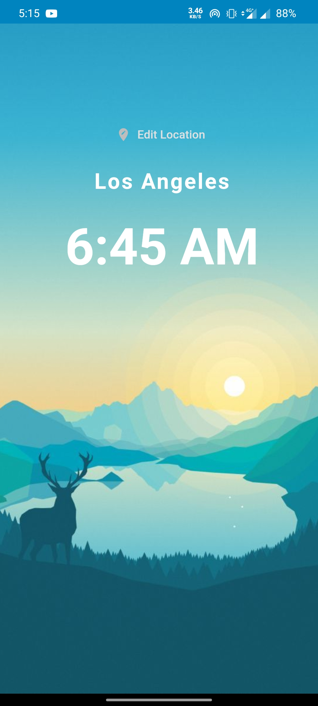
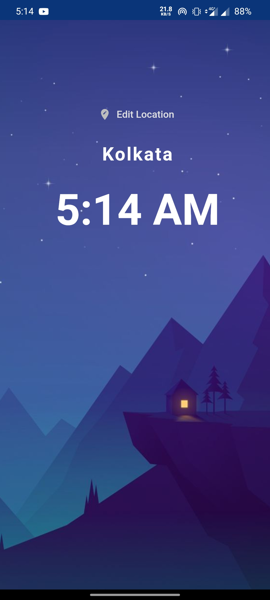
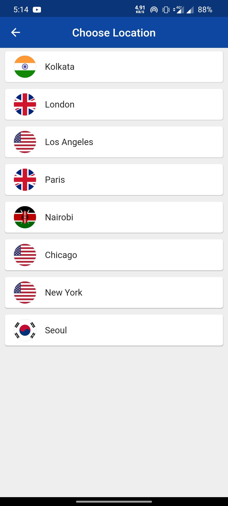

# World Time Flutter App
A simple flutter app that tells time of selected location.

# Demo

   
  
  

<table>
  <tr>
    <td>Morning Time</td>
     <td>Night Time</td>
     <td>Location Chooser</td>
  </tr>
  <tr>
    <td></td>
    <td> </td>
    <td></td>
  </tr>
 </table>

